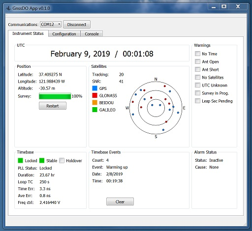

# GNSSDO App

This is a program meant for communicating with and configuring the Stanford
Research Systems [FS752 GNSS Disciplined Oscillator](https://www.thinksrs.com/products/fs752.html).

It is written in Python, using PyQt and is licensed under the GNU General
Public License version 3.

Pull requests and issues welcome.

## Typical Installation

Navigate to the Releases section on this repository and download the installer binary
for your operating system. They are not signed, so your system may complain they are
from an unknown developer (depending on how it is configured). Double click on the
downloaded binary to start the installation.

## Installation from source

This app is written in python, so make sure your system has a suitable version of python
installed before attempting these instructions. This app was built with python 3.6, but
later versions of python may work also. You will also need a copy of `git` installed to
clone the repository (though you can also download a zipped up version from GitHub)

The following commands should install the necessary requirements and get the app running
on a Windows machine in PowerShell, though these instructions should also work with
only slight modifications on OSX or Linux:

    # clone the repository and 'cd' into it
    git clone git@github.com:thinkSRS/gpsdo-app.git
    cd gpsdo-app

    # make sure you have virtualenv installed
    pip3 install virtualenv

    # start a new virtual environment inside the cloned directory
    python -m virtualenv venv

    # activate the virtual environment. In PowerShell, this command is:
    # on OSX or Linux, use the command: "source venv/bin/activate"
    .\venv\Scripts\activate.ps1

    # install the requirements in the activated virtual environment
    pip install -r requirements\base.txt

    # run the application using the FBS runtime
    fbs run

## Generating the binary installers

The binary installers for this app are packaged using Michael Herrmann's
[fman build system](https://build-system.fman.io/), and can be regenerated
by issuing the following commands in an activated virtual environment:

    fman freeze
    fman installer
